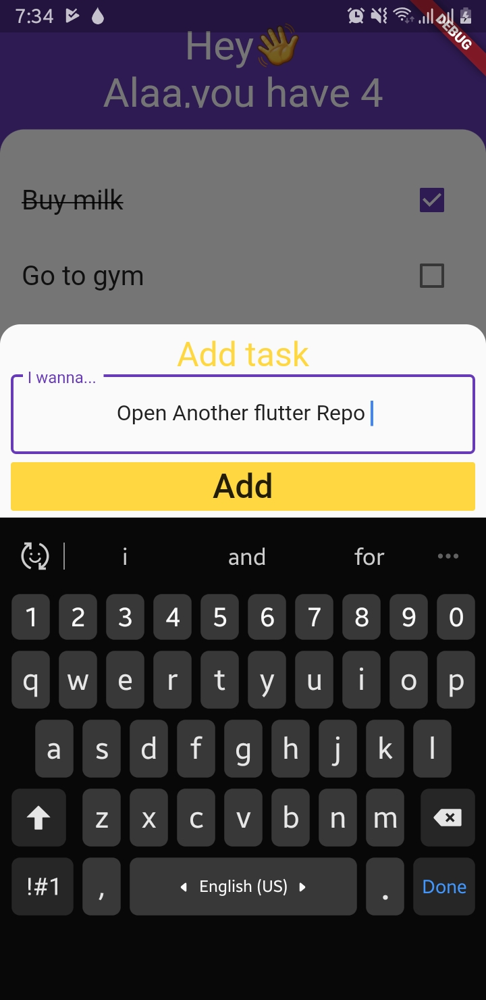
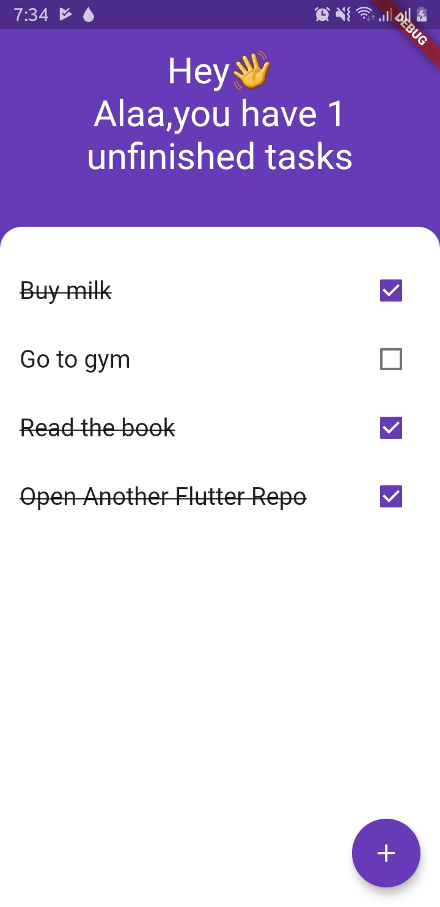

# TODOEY

A flutter TODO app using the provider package and the moor SQL package for flutter
## Screenshots

  
  

## What's diffrent
* Provider is the recommanded state managment solution by the flutter team them selfs 
* thanks to [Provider](https://pub.dev/packages/provider) there is no need for **StatfullWidgets** anymore 

* [Moor](https://pub.dev/packages/moor_flutter "Moor's Website") is an easy to use, reactive persistence library for Flutter apps. Define your database tables in pure Dart and enjoy a fluent query API, auto-updating streams and more!
This project is a starting point for a Flutter application. [For a deep dive in moor please consider this Full SQL todo app with flutter and moor](https://github.com/AlaaEdAouimeur/Flutter-moor-SqlTodo)

A few resources to get you started if this is your first Flutter project:

- [Lab: Write your first Flutter app](https://flutter.dev/docs/get-started/codelab)
- [Cookbook: Useful Flutter samples](https://flutter.dev/docs/cookbook)

For help getting started with Flutter, view our
[online documentation](https://flutter.dev/docs), which offers tutorials,
samples, guidance on mobile development, and a full API reference.
